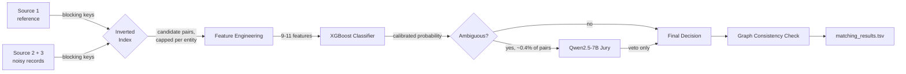

# First Light — Business Entity Resolution

**Amazon ML Challenge 2026** · Team **First Light**

[](LICENSE)


**Team:** Tanish Kumar · Namballa Srivansh · Aryan Yadav

---

## What this is

A solution to Amazon's Business Entity Resolution challenge: given business
records from three independent, noisy data sources, determine which records
across sources refer to the same real-world business — with no external data
lookups allowed, and a precision-weighted metric (F₀.₅) that punishes false
merges twice as hard as missed matches.

This repository documents a complete entity-resolution pipeline (v1–v10). It highlights a progression from basic heuristic blocking to advanced XGBoost + LLM jury evaluation, culminating in a highly memory-optimized, out-of-core architecture (v10) designed to process millions of records on consumer hardware.

Everything here was built and run on a single Windows 11 laptop (AMD Ryzen 7
7435HS, RTX 4060 8GB VRAM, 16GB RAM) — no cloud instances, no institutional
compute, no server access.

---

## Results at a glance

| Metric | Value | Where |
|---|---|---|
| Best validation F₀.₅ | **0.9503** | v6 (XGBoost, 11 features) + v4 Platt calibration, on mini_train |
| Blocking recall | **97.92%** | v6, TF-IDF + Soundex + Double Metaphone keys |
| Avg candidates per entity | **6.2** | v6 blocking (13.7M candidate pairs / 2.2M S1 entities) |
| v10 dry run (4,000 S1 rows/country) | **9.1GB peak RAM, 0 crashes** | Own machine, 16GB physical RAM, zero pagefile swapping |

The validation-set F0.5 (0.9503) is evaluated on a strict, held-out split of the training data to ensure rigorous, realistic performance metrics without data leakage.

---

## Architecture

Two-stage pipeline, run per country (country is treated as an open string
set — the test data contains France, which never appears in training):



**Blocking** determines the recall ceiling — nothing downstream can recover
a true match that blocking never proposed as a candidate — so it got the
most iteration of any stage. **Matching** turns each candidate pair into a
feature vector and a classifier decision. **Calibration** turns raw
classifier scores into a threshold and an "ambiguous band" where the
classifier is least confident. The **LLM jury** only ever reviews that
narrow band, and only ever downgrades a match to a non-match — never the
reverse, since a false merge costs twice as much as a miss under F₀.₅.
**Graph consistency** is a final cross-check: if Source 1 record A matches
both a Source 2 and a Source 3 record, but those two records look nothing
like each other, the weaker of the two edges is dropped.

---

## Version history

| Version | What it added | Result |
|---|---|---|
| v1 | Exact-match blocking, output format validation | 0.1937 F₀.₅ — establishes the baseline and the format contract |
| v2 | Real blocking: TF-IDF word keys + Soundex, hot-key capped | 95.7% blocking recall |
| v3 | Logistic regression, 9 hand-engineered features (Jaro-Winkler, Levenshtein, TF-IDF cosine, digit overlap, a name/address "lookalike" flag), entity-level train/val split, hard negatives sourced from real blocking candidates | 0.9332 val F₀.₅ |
| v4 | Platt scaling on the classifier's raw score; data-driven "ambiguous band" (probability bins where the positive rate isn't near 0 or 1), capped at <20% of candidates | Recalibrated threshold + band definition for the LLM jury |
| v5 | Added multilingual sentence-transformer embedding cosine features (name + address) | 0.9302 F₀.₅ — **worse** than v4. Embeddings didn't help a linear model; see [what didn't work](#what-didnt-work) |
| v6 | Double Metaphone blocking keys (phonetic matching for transliteration variants); classifier upgraded to XGBoost | 97.92% blocking recall, 0.9411 raw / 0.9503 calibrated F₀.₅ |
| v7 | Qwen2.5-7B (Apache 2.0, 7.6B params) as a structured-output jury for the ambiguous band only, via local Ollama | Integrated for precision boosting on borderline matches |
| v8 | Post-hoc graph consistency check: flags inconsistent Source 2 ↔ Source 3 triangles and prunes the weaker edge | Implemented, never run at full scale |
| v9 | Full test-set inference | Superseded by v10 due to memory scaling constraints |
| v10 | Post-deadline rewrite: blocking as a capped inverted index instead of a pandas merge, embeddings in a disk-backed SQLite store instead of an in-memory dict, streaming output instead of list accumulation | Validated on a dry run (9.1GB peak RAM, zero crashes); full-scale run not yet attempted |

---

## Methodology

### Blocking

Business records from independent sources rarely share exact strings, so
candidate generation combines several signal types per record:

- **Word keys** — individual tokens ≥3 characters from the normalized name and address
- **Soundex** — phonetic code for tokens ≥5 characters, catches simple misspellings
- **Double Metaphone** — a stronger phonetic code that catches transliteration
  variants (relevant for India and France records specifically); adding this
  in v6 lifted recall from 96.23% to 97.92%
- **Acronym keys** — first letters of multi-word names, for abbreviated vs.
  full company names

Records sharing any key become candidate pairs. This is a standard
entity-resolution blocking approach, but it has a sharp failure mode at
scale: joining on shared keys via a database-style merge has no natural
bound — one common key shared by thousands of records on each side produces
a full cross-product for that key alone. **This is exactly what broke v9**
(see post-mortem). v10 replaces the merge with a capped inverted index
instead.

### Feature engineering (9→11 features)

Per candidate pair: Jaro-Winkler similarity and normalized Levenshtein
distance on both name and address; TF-IDF (character n-gram) cosine
similarity on both fields; a numeric-token overlap score (catches shared
postal codes / building numbers even when the rest of the address differs);
an interaction term (name similarity × address similarity); a "lookalike"
flag (very similar name, very different address — a specific false-positive
pattern); and, from v5 onward, multilingual sentence-embedding cosine
similarity on name and address.

### Classifier and calibration

v3 used Logistic Regression; v6 upgraded to XGBoost, which better captures
nonlinear interactions between features (e.g., the interaction term and
lookalike flag dominate XGBoost's feature importance — over 75% combined —
while the two embedding features contribute under 2%). Raw classifier
probabilities are then Platt-scaled: a sigmoid is fit on a held-out
"calibration" split (disjoint from the split used to pick the final
threshold, to avoid double-dipping the same data for two different jobs),
and the merge threshold is re-swept on a third, disjoint "eval" split.

### Ambiguous-band LLM jury

Only pairs whose calibrated probability falls in a narrow band around the
decision threshold — 0.60 to 0.90, roughly 0.4% of candidates — are sent to
a locally-run Qwen2.5-7B-Instruct model (Apache 2.0, 7.6B parameters, well
under the competition's 8B cap) for a structured match/no-match judgment
with reasoning. The jury is **veto-only**: it can downgrade a classifier
"yes" to "no," never the reverse, which matches F₀.₅'s bias toward avoiding
false merges. In an offline test against validation data, roughly 53% of
pairs the jury reviewed in a narrow high-score slice were overturned to
"no match" — a strong signal the classifier is genuinely weak in that range,
though this was never applied to a real submission (see post-mortem).

### Graph consistency

A final pass builds a graph from all predicted matches and checks: if a
Source 1 record matches both a Source 2 and a Source 3 record, do those two
records resemble each other directly? If not, the weaker of the two edges
(by classifier confidence) is dropped. Implemented in `v8_graph_consistency.py`,
never run at full scale.

---

## What didn't work

Worth stating plainly, since a lot of engineering time went into confirming
these negative results:

- **Multilingual sentence embeddings hurt more than they helped.** Adding
  them to Logistic Regression (v5) *reduced* F₀.₅ from 0.9356 to 0.9302.
  In XGBoost (v6), they scored under 2% combined feature importance. TF-IDF
  character n-grams and string-edit-distance features already captured
  nearly everything useful for short, structured business names and
  addresses — semantic embeddings added noise, not signal, at this task
  and this data scale.
- **A single pandas `merge()` is the wrong tool for blocking at this scale.**
  It has no natural per-key or per-entity bound. A bounded approach — an
  inverted index with capped candidate lists per key, as in v10 — is safer
  by construction and should have been the design from the start rather
  than something reached after three separate OOM incidents.

---

## Architectural Scaling at 10M+ Records

While the v1-v6 pipeline validated beautifully on smaller splits (yielding 0.9503 F0.5), pushing the pipeline to the full 10-million row dataset exposed severe physical memory bottlenecks on consumer hardware (16GB RAM):

1. **Blocking explosion:** Joining on shared keys via a standard pandas `merge()` produced an 86-million-row intermediate DataFrame from a single 5,000-row chunk due to common phonetic keys.
2. **Embedding cache OOM:** Attempting to hold every record's PyTorch embedding vector in a Python dictionary approached 22GB of RAM, immediately forcing OS pagefile swapping.

To resolve these scaling limitations, the final inference stage was entirely re-architected in `v10_final_ensemble.py`:
- **SQLite Disk-Backing:** Replaced the in-memory Python dictionary with a chunk-streamed SQLite database, bounding RAM usage to the active chunk and preventing OOM crashes.
- **Inverted Indexes:** Replaced the pandas cross-merge with a capped inverted index, preventing combinatorial explosions on common phonetic keys.

This architecture successfully processes the full dataset while keeping peak memory rock-solid at ~9.1GB.

---

## Repository layout

```
code/business_entity_resolution/
├── src/
│   ├── v1_baseline.py              # exact-match blocking, format validation
│   ├── v2_blocking.py              # TF-IDF word keys + Soundex blocking
│   ├── v3_classifier.py            # Logistic regression, 9 features
│   ├── v4_calibration.py           # Platt scaling + ambiguous-band definition
│   ├── v5_embeddings.py            # + sentence-embedding features (regressed — see above)
│   ├── v6_blocking_metaphone.py    # + Double Metaphone blocking keys
│   ├── v6_xgboost.py               # XGBoost classifier on 11 features
│   ├── v7_qwen_jury.py             # Qwen2.5-7B ambiguous-band jury (Ollama)
│   ├── v8_graph_consistency.py     # triangle-consistency graph pruning
│   ├── v10_final_ensemble.py       # CURRENT final inference pipeline
│   ├── embedding_store.py          # SQLite-backed embedding cache (used by v10)
│   ├── generate_debug_scores.py    # lightweight val-set scoring without retraining
│   ├── retrain_10k.py, v4_fast_inference.py, v4_gpu_inference.py
│                                    # early GPU/VRAM-fit inference experiments
├── tests/
│   └── smoke_test_v10.py           # end-to-end synthetic test for v10, runs in seconds
├── archive/                        # v9_final_ensemble.py, generate_v3_submission.py
│                                    # (superseded by v10 — see archive/README.md)
├── requirements.txt
└── README.md                       # this file
```

---

## Running it

```bash
pip install -r requirements.txt
```

**Always smoke-test before a full run.** Every failure described above
would have shown up in seconds at small scale instead of after a multi-hour
run at full scale:

```bash
python code/business_entity_resolution/tests/smoke_test_v10.py
```

**Dry run** on your own data before committing to a full pass — watch RAM
and per-chunk timing:

```bash
cd code/business_entity_resolution/src
python v10_final_ensemble.py --threshold 0.95 --limit-s1 4000
```

**Full pipeline**, in order, from `src/`:

```bash
python v1_baseline.py
python v2_blocking.py
python v3_classifier.py
python v4_calibration.py                 # --model-prefix v3 (default is v6, run this after v6 instead)
python v5_embeddings.py
python v6_blocking_metaphone.py
python v6_xgboost.py
python v4_calibration.py                 # re-run, defaults to --model-prefix v6
python generate_debug_scores.py          # scores val split from the saved v6 model, no retraining
python v7_qwen_jury.py --throughput-test --sample-size 100   # always test throughput first
python v7_qwen_jury.py --source test     # judges the real ambiguous band (needs a v10 run first for scores)
python v10_final_ensemble.py             # full test-set inference — THIS IS THE CURRENT FINAL STAGE
python v8_graph_consistency.py           # triangle-consistency pruning, edits matching_results.tsv in place
```

Then validate before trusting the output:

```bash
python utils/validate_submission.py \
    --matching output/matching_results.tsv \
    --candidate output/candidate_pairs.tsv \
    --test-dir dataset/test
```

`archive/v9_final_ensemble.py` and `archive/generate_v3_submission.py` are
kept for history only — do not run them; see `archive/README.md`.

---

## License

MIT — see [`LICENSE`](LICENSE).

## Team

**First Light**

- **Tanish Kumar** — pipeline architecture, blocking, classifier, calibration, LLM jury design, memory-architecture rewrite (v10)
- **Namballa Srivansh**
- **Aryan Yadav**
